    rm(list=ls())
    library(knitr)
    library(mosaic)

    ## Loading required package: dplyr

    ## 
    ## Attaching package: 'dplyr'

    ## The following objects are masked from 'package:stats':
    ## 
    ##     filter, lag

    ## The following objects are masked from 'package:base':
    ## 
    ##     intersect, setdiff, setequal, union

    ## Loading required package: lattice

    ## Loading required package: ggformula

    ## Loading required package: ggplot2

    ## Loading required package: ggstance

    ## 
    ## Attaching package: 'ggstance'

    ## The following objects are masked from 'package:ggplot2':
    ## 
    ##     geom_errorbarh, GeomErrorbarh

    ## 
    ## New to ggformula?  Try the tutorials: 
    ##  learnr::run_tutorial("introduction", package = "ggformula")
    ##  learnr::run_tutorial("refining", package = "ggformula")

    ## Loading required package: mosaicData

    ## Loading required package: Matrix

    ## Registered S3 method overwritten by 'mosaic':
    ##   method                           from   
    ##   fortify.SpatialPolygonsDataFrame ggplot2

    ## 
    ## The 'mosaic' package masks several functions from core packages in order to add 
    ## additional features.  The original behavior of these functions should not be affected by this.
    ## 
    ## Note: If you use the Matrix package, be sure to load it BEFORE loading mosaic.

    ## 
    ## Attaching package: 'mosaic'

    ## The following object is masked from 'package:Matrix':
    ## 
    ##     mean

    ## The following object is masked from 'package:ggplot2':
    ## 
    ##     stat

    ## The following objects are masked from 'package:dplyr':
    ## 
    ##     count, do, tally

    ## The following objects are masked from 'package:stats':
    ## 
    ##     binom.test, cor, cor.test, cov, fivenum, IQR, median,
    ##     prop.test, quantile, sd, t.test, var

    ## The following objects are masked from 'package:base':
    ## 
    ##     max, mean, min, prod, range, sample, sum

    library(ggplot2)
    library(tidyverse)

    ## ── Attaching packages ─────────────────────────────────────────────── tidyverse 1.2.1 ──

    ## ✔ tibble  2.1.3     ✔ purrr   0.3.2
    ## ✔ tidyr   0.8.3     ✔ stringr 1.4.0
    ## ✔ readr   1.3.1     ✔ forcats 0.4.0

    ## ── Conflicts ────────────────────────────────────────────────── tidyverse_conflicts() ──
    ## ✖ mosaic::count()            masks dplyr::count()
    ## ✖ purrr::cross()             masks mosaic::cross()
    ## ✖ mosaic::do()               masks dplyr::do()
    ## ✖ tidyr::expand()            masks Matrix::expand()
    ## ✖ dplyr::filter()            masks stats::filter()
    ## ✖ ggstance::geom_errorbarh() masks ggplot2::geom_errorbarh()
    ## ✖ dplyr::lag()               masks stats::lag()
    ## ✖ mosaic::stat()             masks ggplot2::stat()
    ## ✖ mosaic::tally()            masks dplyr::tally()

    library(dplyr)

    green = read.csv('../Data/greenbuildings.csv')
    green = na.omit(green)

Get summaries of age and leasing\_rate variables and decide what range
of occpancy to keep: &gt;10%

    summary(green$age)

    ##    Min. 1st Qu.  Median    Mean 3rd Qu.    Max. 
    ##     0.0    23.0    34.0    47.1    79.0   171.0

    summary(green$leasing_rate)

    ##    Min. 1st Qu.  Median    Mean 3rd Qu.    Max. 
    ##    0.00   77.89   89.54   82.63   96.50  100.00

    boxplot(green$leasing_rate)

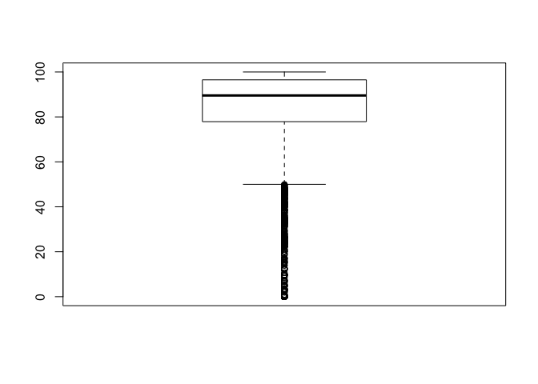

Check whether age is a confounding variable

    ggplot(green)+
      geom_histogram(aes(x=age, y=stat(density)), binwidth=2) +
      facet_grid(green_rating~.)

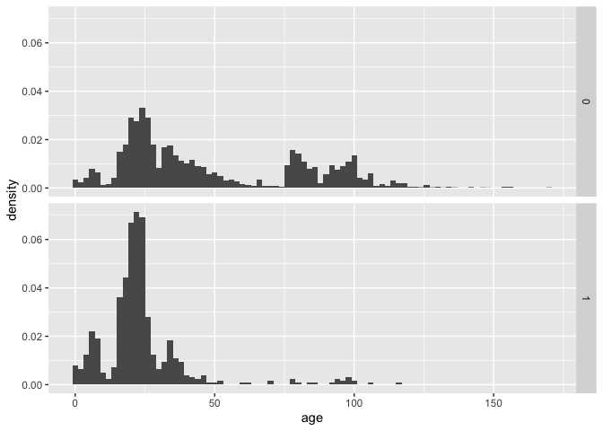 
We plotted the number of green and non-green buildings for different age,
and found that when age greater than 50 there are very few instances of
green buildings. We assume the reason behind this is that most green
buildings are relatively new and are built within 50 years. So, using
only instances of green buildings that have age less than 50 for our
analysis would be more representative. Also, we know that age is a
confounding variable from this distribution graph, so we want to group
ages and see how rent and other costs vary for different age groups.

############### (occupancy &gt; 10%) & (hold age roughly constant)

explore occupancy &gt; 10

    ## remove "outliers"
    df_10above_LR<-green[!(green$leasing_rate<10),]

cut age into groups

    df_10above_LR$age_groups <- cut(df_10above_LR$age, c(-1, 8, 20, 50), include.lowest = TRUE)

filter out age group

    first2_age_10 = df_10above_LR %>%
      filter(age_groups == '[0,8]' | age_groups == '(8,20]' |age_groups == '(20,50]')

We created 3 age groups that have range from 0-8, 8-20, and 20-50. We
fitted all the instances we have into these three age groups.

Boxplot rent by the age groups, and check whether rent is actually
higher for green buildings than not-green buildings for all age groups

    ggplot(data=first2_age_10) + 
      geom_boxplot(aes(x=age_groups, y=Rent, fill=factor(green_rating))) + 
      theme_bw(base_size=18)+ ggtitle("Plot of rent (occupancy > 10)")

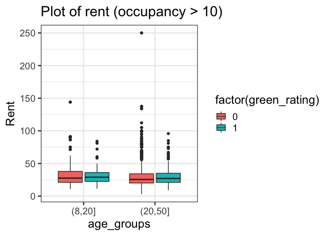
Considering only rent, we plotted boxplots of rent for the three
different age groups. We can see that for the first age group (0,8), the
median rent of non-green buildings is actually higher than the median
rent of green buildings. As age increases, the median rent of green
buildings starts increasing and becomes about the same as the median
rent of non-green buildings in the second and the third groups. However,
the staff claims that the median rents for both green and non-green
buildings are flat rates. This is incorrect since he was not supposed to
use the median calculated from instances that span the entire age range,
as the median values for the two types of buildings actually fluctuate
as age changes. Thus, we cannot be sure that investing in green
buildings will generate about $2.60 more per square foot in revenue. It
might not be feasible to recuperate the costs in around 8 years.

Boxplot total cooling+heating days for each age groups

    ggplot(data=first2_age_10) + 
      geom_boxplot(aes(x=age_groups, y=total_dd_07, fill=factor(green_rating))) + 
      theme_bw(base_size=18)+ ggtitle("Cost factor: # of cooling+heating days (occupancy>10)")+ ylab("# of total cooling+heating days")

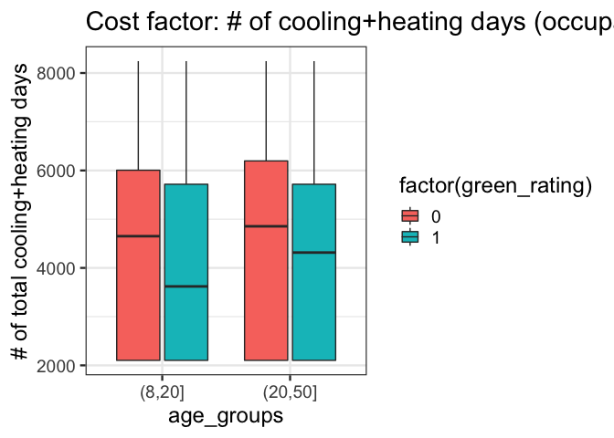 
In order to control the confounding effect of the age variable, we keep using the
three age groups mentioned above. In term of total number of cooling and
heating degree days, from the box plot we can see that for the first age
group, the median of total number of degree days of green buildings is
actually higher than that of non-green buildings, implying a greater
demand of energy. This might generate a higher cost during heating or
cooling days in the first 8 years for green buildings. The staff
incorrectly assume that the cost for both green and non-green buildings
are about the same, which is not the case.

Boxplot electricity cost + gas cost for each age groups

    first2_age_10$totalCost <- with(first2_age_10, Electricity_Costs+Gas_Costs)

    ggplot(data=first2_age_10) + 
      geom_boxplot(aes(x=age_groups, y=totalCost, fill=factor(green_rating))) + 
      theme_bw(base_size=18)+ ggtitle("Cost factor (occupancy > 10)")+ ylab("total costs")

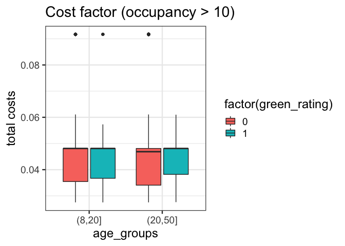 
Then we looked at the graph that plots the electricity and gas costs. In the
first age group, we did see a lower median value of the total costs for
green buildings. However, in the second and third groups (buildings with
age higher than 8), the median values of the total cost are actually the
same or even higher for green buildings. The staff falsely believe that
the total electricity and gas cost for green buildings will always be
lower than non-green buildings. This further proves that the staff
assumption about revenue and cost are not correct.

############### 

How should the staff improve his/her recommendation? The staff should
take consideration into the confounding effect that the age variable
caused that influence his/her cost/benefit analysis.

################### 

Question 2: \#\#\#\#\#\#\#\#\#\#\#\#\#\#\#\#\#\#\# 
Your task is to create a figure, or set of related figures, that tell an interesting
story about flights into and out of Austin. You can annotate the figure
with a detailed caption, of course, but strive to make it as stand-alone
as possible. It shouldn’t need many, many paragraphs to convey its
meaning. Rather, the figure should speak for itself as far as possible.

(a)What is the best time of day to fly to minimize delays? (b)What is
the best time of year to fly to minimize delays? (c)wHAT ARE the bad
UniqueCarrier to fly?

    # Read data and import library
    rm(list=ls())
    library(MASS)

    ## 
    ## Attaching package: 'MASS'

    ## The following object is masked from 'package:dplyr':
    ## 
    ##     select

    library(ISLR)
    library(leaps)
    library(Matrix)
    library(foreach)

    ## 
    ## Attaching package: 'foreach'

    ## The following objects are masked from 'package:purrr':
    ## 
    ##     accumulate, when

    library(mosaic)
    library(tidyverse)
    library(ggplot2)
    set.seed(1)
    fly_data <- read.csv("../Data/ABIA.csv",header=TRUE)
    attach(fly_data)
    names(fly_data)

    ##  [1] "Year"              "Month"             "DayofMonth"       
    ##  [4] "DayOfWeek"         "DepTime"           "CRSDepTime"       
    ##  [7] "ArrTime"           "CRSArrTime"        "UniqueCarrier"    
    ## [10] "FlightNum"         "TailNum"           "ActualElapsedTime"
    ## [13] "CRSElapsedTime"    "AirTime"           "ArrDelay"         
    ## [16] "DepDelay"          "Origin"            "Dest"             
    ## [19] "Distance"          "TaxiIn"            "TaxiOut"          
    ## [22] "Cancelled"         "CancellationCode"  "Diverted"         
    ## [25] "CarrierDelay"      "WeatherDelay"      "NASDelay"         
    ## [28] "SecurityDelay"     "LateAircraftDelay"

1.  What is the best time of day to fly to minimize delays?

DepTime actual departure time (local, hhmm) CRSDepTime scheduled
departure time (local, hhmm) ArrTime actual arrival time (local, hhmm)
CRSArrTime scheduled arrival time (local, hhmm)

ArrDelay arrival delay, in minutes DepDelay departure delay, in minutes

    # Create new col called total_delay to store the abs value of total delay minutes
    fly_data$Total_delay = abs(fly_data$ArrDelay) + abs(fly_data$DepDelay)

    ggplot(data = fly_data) + 
      geom_point(mapping = aes(x = DepTime, y = Total_delay)) +
      labs(title = "Delay Time Over an Entire Day")

    ## Warning: Removed 1601 rows containing missing values (geom_point).

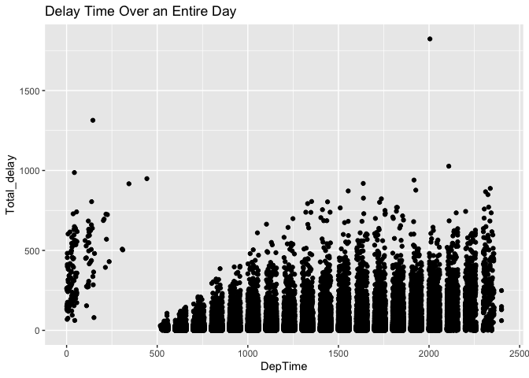

    # By plot the DepTime vs Total_delay, we can observe that the majority of the delay happens during 
    # 5:00 ~ end(24:00). And there are some scatter points between 0 ~ 5:00
    # However, we cannot conclude that the best time to fly is between around 2 to 5 because there is no delay in the picture. Let's do a hist for Dep time to invest a bit more.

    hist(DepTime)

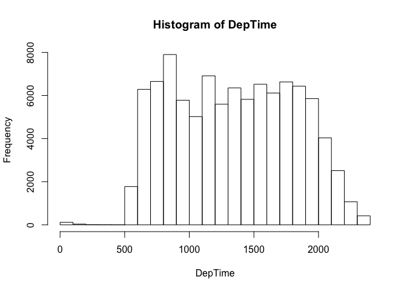

    # By the Histogram of DepTime, we do see that there is almost no flights take off during 2 to 5. Therefore, that would be the main reason why we see little dots in the "Delay Time Over an Entire Day"

    # Thus, we do need to re-observe the "Delay Time Over an Entire Day" plot. There are mainly two features in the plot to provide the information we need.
    # 1 How far are points away from the x-axis represent the delay length.
    # 2 How many points are listed above a certain time(x-axis) represents the total times of delay at that time.
    # By observing using the two features above, the best time over the day is in the range of [0:00, 10:00]

    # Let's using this particular time range to explore a bit more to shrink the range.

    nrow(fly_data)

    ## [1] 99260

    #Mask, we only want the time between 0 ~ 10
    cleaned_data = fly_data[which(fly_data$DepTime <= 1000),]
    nrow(cleaned_data)

    ## [1] 28552

    # Try fit the model with y = b0 + b1*x1
    lm.fit = lm(cleaned_data$Total_delay~cleaned_data$DepTime,data = cleaned_data)
    summary(lm.fit)

    ## 
    ## Call:
    ## lm(formula = cleaned_data$Total_delay ~ cleaned_data$DepTime, 
    ##     data = cleaned_data)
    ## 
    ## Residuals:
    ##     Min      1Q  Median      3Q     Max 
    ##  -31.77  -13.28   -5.48    3.24 1257.92 
    ## 
    ## Coefficients:
    ##                       Estimate Std. Error t value Pr(>|t|)    
    ## (Intercept)          64.895706   1.324171   49.01   <2e-16 ***
    ## cleaned_data$DepTime -0.060782   0.001708  -35.59   <2e-16 ***
    ## ---
    ## Signif. codes:  0 '***' 0.001 '**' 0.01 '*' 0.05 '.' 0.1 ' ' 1
    ## 
    ## Residual standard error: 36.87 on 28501 degrees of freedom
    ##   (49 observations deleted due to missingness)
    ## Multiple R-squared:  0.04255,    Adjusted R-squared:  0.04252 
    ## F-statistic:  1267 on 1 and 28501 DF,  p-value: < 2.2e-16

    plot(cleaned_data$DepTime, cleaned_data$Total_delay)
    abline(lm.fit, col="green")

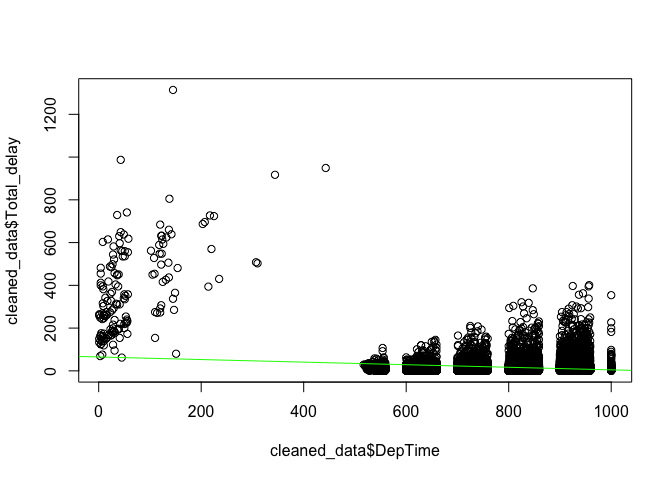

    # By above lm model, it is not really a good idea to use fit line here.

    ggplot(cleaned_data, aes(DepTime, Total_delay)) +
      geom_point(aes(color = Origin)) +
      geom_smooth(se = FALSE) +
      labs(title = "Delay Length(mins) Over an Entire Day(Cleaned)")

    ## `geom_smooth()` using method = 'gam' and formula 'y ~ s(x, bs = "cs")'

    ## Warning: Removed 49 rows containing non-finite values (stat_smooth).

    ## Warning: Removed 49 rows containing missing values (geom_point).

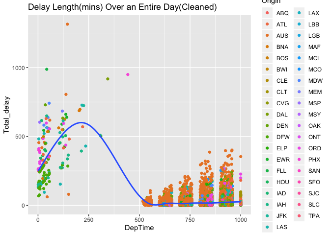

    # 
    # And by plotting the origin, we can observe that after 5, austin airport start to function(working start time for
    # airport staff)

Description: Let’s take a closer look at the ggplot above. The X-axis
represents the Departure Time of the flight, Y-axis represents the total
length of delay for that flight. The additional feature is all the
points are colored by its origin(origin IATA airport code).

Analysis: Between time\[0:00,2:50\], there aren’t as many of delays as
other time, but they all pretty spread out(long delay time). While
between \[5:00:10:00\], all the data points are condensed together to
form a shape like bar plot. It represents that in the \[5:00,10:00\]
time range, all the delays are short-timed.

Overall, the best time of a regular day to fly to minimize delay would
have two possible solutions: If we pay more attention on the perspective
of less number of delays, the best time would be: \[0:00,2:50\] and
\[5:00,700\] If we pay more attention on the perspective of less delay
length, the best time would be: \[5:00,8:00\]

By intersect the time range above, the best time overall would be:
\[5:00,7:00\]

(b)What is the best time of year to fly to minimize delays?

Year all 2008 Month 1-12 DayofMonth 1-31

    # import library
    library(tidyr)
    library(dplyr)

    # Combine month and dayofmonth
    fly_data2 = transform(fly_data, Combined_date=paste(fly_data$Month, fly_data$DayofMonth, fly_data$Year,sep="/"))

    # Convert the Combined_Date to Date format
    fly_data2$Combined_date = as.Date(fly_data2$Combined_date, format = "%m/%d/%Y")
    #fly_data2

    plot(fly_data2$Combined_date, fly_data2$Total_delay,main="Delay Over Year",
      xlab="Date", ylab="Delay(min)")

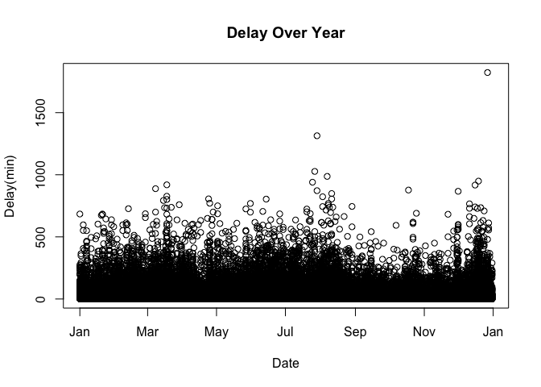

    # The plot cannot provide anything useful, there, I decide to count delay times

    # Aggregate the number of delay times based on Date.
    delay_df = aggregate(fly_data2$Year ~ fly_data2$Combined_date, data = fly_data2, count)
    delay_df2 = aggregate(fly_data2$Total_delay ~ fly_data2$Combined_date, data = fly_data2, sum)

    # Merge based on Date
    combined_df = merge(delay_df, delay_df2, by = "fly_data2$Combined_date", sort = TRUE)
    #combined_df

    # Rename for sort
    names(combined_df)[1] <- "Date"
    names(combined_df)[2] <- "Delay_Times"
    names(combined_df)[3] <- "Delay_Length"
    combined_df <-combined_df[order(combined_df$Delay_Times),]

    # Reset index and sort based on Date
    rownames(combined_df) <- NULL
    combined_df = combined_df[order(combined_df$Delay_Length),]
    #combined_df

    ggplot(combined_df, aes(Date, Delay_Length)) +
      geom_point(aes(color = Delay_Times)) +
      geom_smooth(se = FALSE) +
      labs(title = "Delay Time Over an Entire Year")

    ## `geom_smooth()` using method = 'loess' and formula 'y ~ x'

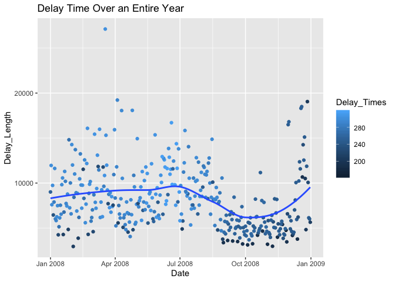
Description: By observing the “Delay Time Over an Entire Year” plot,the
X-axis represents the specific Date over a year. Because we have sorted
the Date and there are too many points, gg plot automatically put the
general Month instead of specific date for X-axis. The Y-axis represents
the total delay length for a flight over entire year. Additional feature
is that we colored the points by the number of delayed times over entire
year. It gets darker if it has less number of delays.

Analysis: We may conclude that the best time of an entire year to fly
possibly over the time range of \[Sept, Dec\] mainly for two reasons. 1.
Less data points are spreaded there. 2. These data points have shorter
Delay\_Length than other data points.

We can provide more specific date, but that probably won’t be super
helpful since most of people usually would have a rough time range to
fly rather than a specific date to fly. If that person has a specific
date to fly, then he should use the conclusion from our first question.

(c)WHAT ARE the bad UniqueCarrier to fly?

UniqueCarrier unique carrier code FlightNum flight number

    plot(fly_data$UniqueCarrier,fly_data$Total_delay,main="Delay Over UniqueCarrier",
      xlab="UniqueCarrier", ylab="Delay(min)")

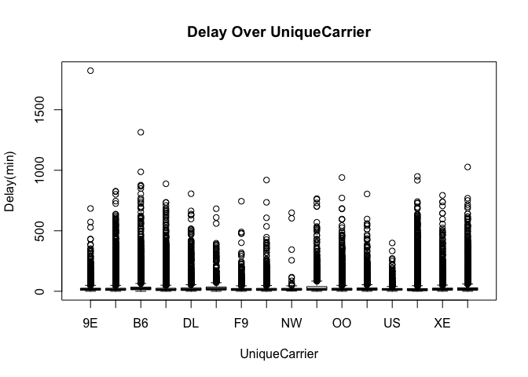

    # Aggregate the number of delay times based on Date.
    UniqueCarrier_df = aggregate(fly_data$Year ~ fly_data$UniqueCarrier, fly_data, count)
    UniqueCarrier_df2 = aggregate(fly_data$Total_delay ~ fly_data$UniqueCarrier, fly_data, sum)

    # Merge based on UniqueCarrier
    combined_df = merge(UniqueCarrier_df, UniqueCarrier_df2, by = "fly_data$UniqueCarrier", sort = TRUE)
    #combined_df

    # Rename for sort
    names(combined_df)[1] <- "UniqueCarrier"
    names(combined_df)[2] <- "Delay_Times"
    names(combined_df)[3] <- "Delay_Length"

    combined_df <-combined_df[order(combined_df$Delay_Times),]

    ggplot(combined_df, aes(Delay_Times, Delay_Length)) +
      geom_point(aes(color = UniqueCarrier)) +
      geom_smooth(se = FALSE) +
      labs(title = "Worst UniqueCarrier")

    ## `geom_smooth()` using method = 'loess' and formula 'y ~ x'

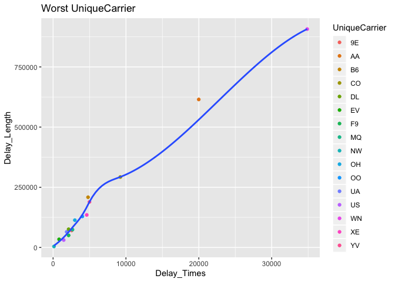
Description: By observing the “Wosrt UniqueCarrier” plot above, the
x-axis represent the total number of times for a UniqueCarrier to delay.
And the y-axis represents the toatl Length of delay for that
UniqueCarrier over the year. The additional feature is that point is
colored by its UniqueCarrier.

Analysis: Therefore, the closer the point gets to the \[0,0\] grid, the
better the UniqueCarrier behaves.

    # bad UniqueCarrier:
    bad_UniqueCarrier = combined_df[which(combined_df$Delay_Times > 10000),]
    bad_UniqueCarrier

    ##    UniqueCarrier Delay_Times Delay_Length
    ## 2             AA       19995       614893
    ## 14            WN       34876       907241

    # Best Unique Carrier:
    good_UniqueCarrier1 = combined_df[which(combined_df$Delay_Times <2500),]
    good_UniqueCarrier2 = combined_df[which(combined_df$Delay_Length <70000),]
    best = merge(good_UniqueCarrier1, good_UniqueCarrier2, by = "UniqueCarrier", sort = TRUE)
    best

    ##   UniqueCarrier Delay_Times.x Delay_Length.x Delay_Times.y Delay_Length.y
    ## 1            EV           825          33704           825          33704
    ## 2            F9          2132          50160          2132          50160
    ## 3            NW           121           4119           121           4119
    ## 4            UA          1866          64681          1866          64681
    ## 5            US          1458          30893          1458          30893

Above is additional result that help us obtain the specific best
UniqueCarrier and worst one. The good ones are : EV F9 NW UA US

The bad ones are: AA, WN

################### 

Question 3 \#\#\#\#\#\#\#\#\#\#\#\#\#\#\#\#\#\#\#

    rm(list=ls())

    library(mosaic)
    library(quantmod)

    ## Loading required package: xts

    ## Loading required package: zoo

    ## 
    ## Attaching package: 'zoo'

    ## The following objects are masked from 'package:base':
    ## 
    ##     as.Date, as.Date.numeric

    ## Registered S3 method overwritten by 'xts':
    ##   method     from
    ##   as.zoo.xts zoo

    ## 
    ## Attaching package: 'xts'

    ## The following objects are masked from 'package:dplyr':
    ## 
    ##     first, last

    ## Loading required package: TTR

    ## Registered S3 method overwritten by 'quantmod':
    ##   method            from
    ##   as.zoo.data.frame zoo

    ## Version 0.4-0 included new data defaults. See ?getSymbols.

    library(foreach)

    #FIRST porfolio  agricultrual equity

    # Import a few stocks
    mystocks_1 = c("DBA", "CORN", "RJA")
    #get last five year data
    myprices = getSymbols(mystocks_1, from = "2014-01-01")

    ## 'getSymbols' currently uses auto.assign=TRUE by default, but will
    ## use auto.assign=FALSE in 0.5-0. You will still be able to use
    ## 'loadSymbols' to automatically load data. getOption("getSymbols.env")
    ## and getOption("getSymbols.auto.assign") will still be checked for
    ## alternate defaults.
    ## 
    ## This message is shown once per session and may be disabled by setting 
    ## options("getSymbols.warning4.0"=FALSE). See ?getSymbols for details.

    # Adjust for splits and dividends
    for(ticker in mystocks_1) {
        expr = paste0(ticker, "a = adjustOHLC(", ticker, ")")
        eval(parse(text=expr))
    }

    # Combine close to close changes in a single matrix
    all_returns = cbind(ClCl(DBAa),ClCl(CORNa),ClCl(RJAa))
    #omit NA column
    all_returns = as.matrix(na.omit(all_returns))

    N = nrow(all_returns)

    # Now loop over two trading weeks
    initial_wealth =100000
    sim1 = foreach(i=1:10000, .combine='rbind') %do% {
        total_wealth = initial_wealth
        weights = c(1/3,1/3,1/3)
        holdings = weights * total_wealth
        n_days = 20
        wealthtracker = rep(0, n_days)
        for(today in 1:n_days) {
            return.today = resample(all_returns, 1, orig.ids=FALSE)
            holdings = holdings + holdings*return.today
            total_wealth = sum(holdings)
            wealthtracker[today] = total_wealth
        }
        wealthtracker
    }
    #Get the 5% level of the total capital at the last/20th trading day 
    lowest = quantile(sim1[,n_days],0.05)
    #Value at Risk(in percentage)
    VaR_1 = (lowest-initial_wealth)/initial_wealth*100
    VaR_1

    ##        5% 
    ## -6.171921

    #histogram of distribution of the wealth after 20 trading days for 10,000 trials
    #with red line showing lowest 5% of the disbrution of total returns
    hist(sim1[,n_days], 25)
    abline(v=lowest, col="red", lw=1)

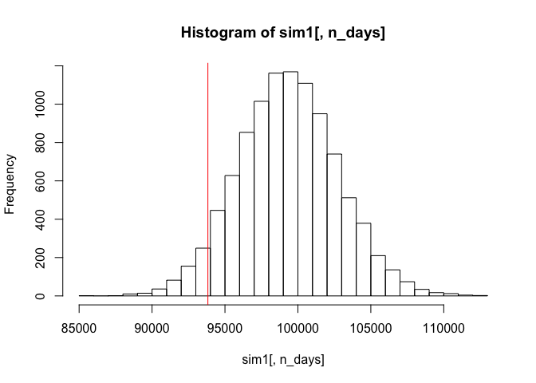

    #SECOND PORFOLIO  China equity

    # Import a few stocks(China equity)
    mystocks_2 = c("MCHI", "FXI", "ASHR","GXC","CQQQ")
    #get last five year data
    myprices_2 = getSymbols(mystocks_2, from = "2014-01-01")

    # Adjust for splits and dividends
    for(ticker in mystocks_2) {
        expr = paste0(ticker, "a = adjustOHLC(", ticker, ")")
        eval(parse(text=expr))
    }

    # Combine close to close changes in a single matrix
    all_returns_2 = cbind(ClCl(MCHIa),ClCl(FXIa),ClCl(ASHRa),ClCl(GXCa),ClCl(CQQQa))
    #omit NA column
    all_returns_2 = as.matrix(na.omit(all_returns_2))

    # Now loop over two trading weeks
    initial_wealth_2 = 100000
    sim2 = foreach(i=1:10000, .combine='rbind') %do% {
        total_wealth_2 = initial_wealth_2
        weights_2 = c(0.2,0.2,0.2,0.2,0.2)
        holdings_2 = weights_2 * total_wealth_2
        n_days = 20
        wealthtracker_2 = rep(0, n_days)
        for(today in 1:n_days) {
            return.today_2 = resample(all_returns_2, 1, orig.ids=FALSE)
            holdings_2 = holdings_2 + holdings_2*return.today_2
            total_wealth_2 = sum(holdings_2)
            wealthtracker_2[today] = total_wealth_2
        }
        wealthtracker_2
    }
    #Get the 5% level of the total capital at the last/20th trading day 
    lowest = quantile(sim2[,20],0.05)
    #Value at Risk(in percentage)
    VaR_2 = (lowest-initial_wealth_2)/initial_wealth_2*100
    VaR_2

    ##        5% 
    ## -9.780584

    #histogram of distribution of the wealth after 20 trading days for 10,000 trials
    #with red line showing 5% of the disbrution from worst to best
    hist(sim2[,n_days], 25)
    abline(v=lowest, col="red", lw=1)

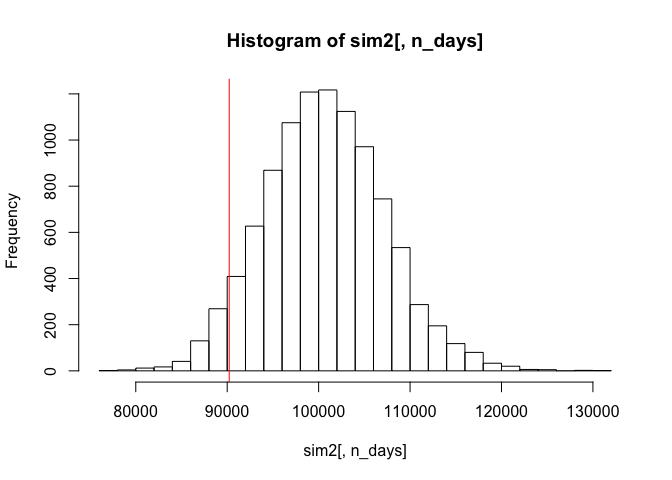

    #THIRD PORFOLIO  big technology equity

    # Import a few stocks(China equity)
    mystocks_3 = c("XLK", "VGT", "IYW","IGV","IXN","FTEC","QTEC","FXL","SKYY","RYT")
    #get last five year data
    myprices_3 = getSymbols(mystocks_3, from = "2014-01-01")

    ## pausing 1 second between requests for more than 5 symbols
    ## pausing 1 second between requests for more than 5 symbols
    ## pausing 1 second between requests for more than 5 symbols
    ## pausing 1 second between requests for more than 5 symbols
    ## pausing 1 second between requests for more than 5 symbols
    ## pausing 1 second between requests for more than 5 symbols

    # Adjust for splits and dividends
    for(ticker in mystocks_3) {
        expr = paste0(ticker, "a = adjustOHLC(", ticker, ")")
        eval(parse(text=expr))
    }

    # Combine close to close changes in a single matrix
    all_returns_3 = cbind(ClCl(XLKa),ClCl(VGTa),ClCl(IYWa),ClCl(IGVa),ClCl(IXNa),ClCl(FTECa),ClCl(QTECa),ClCl(FXLa),ClCl(SKYYa),ClCl(RYTa))
    #omit NA column
    all_returns_3 = as.matrix(na.omit(all_returns_3))

    # Now loop over two trading weeks
    initial_wealth_3 = 100000
    sim3 = foreach(i=1:10000, .combine='rbind') %do% {
        total_wealth_3 = initial_wealth_3
        weights_3 = c(0.1,0.1,0.1,0.1,0.1,0.1,0.1,0.1,0.1,0.1)
        holdings_3 = weights_3 * total_wealth_3
        n_days = 20
        wealthtracker_3 = rep(0, n_days)
        for(today in 1:n_days) {
            return.today_3 = resample(all_returns_3, 1, orig.ids=FALSE)
            holdings_3 = holdings_3 + holdings_3*return.today_3
            total_wealth_3 = sum(holdings_3)
            wealthtracker_3[today] = total_wealth_3
        }
        wealthtracker_3
    }

    #Get the 5% level of the total capital at the last/20th trading day 
    lowest = quantile(sim3[,20],0.05)
    #Value at Risk(in percentage)
    VaR_3 = (lowest-initial_wealth_3)/initial_wealth_3*100
    VaR_3

    ##        5% 
    ## -6.429252

    #histogram of distribution of the wealth after 20 trading days for 10,000 trials
    #with red line showing 5% of the disbrution from worst to best
    hist(sim3[,n_days], 25)
    abline(v=lowest, col="red", lw=1)

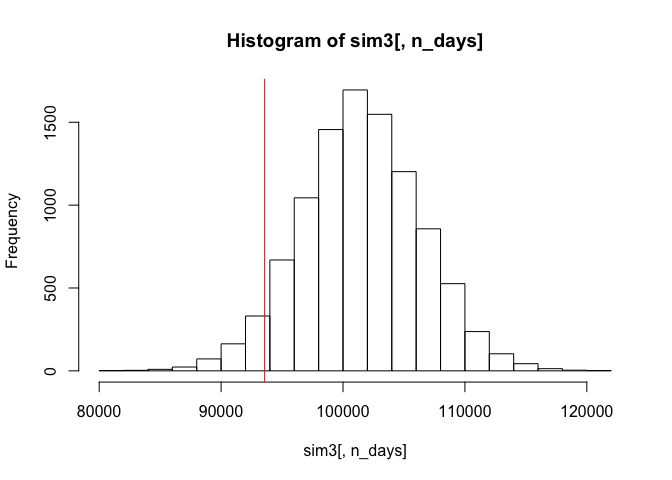 Report:
Using the package above, I have created three different portfolios in
Commodity and two different areas of Equities. For all the three
portfolios, instead of the number of the importing different number
ETFs, we make sure and use all the funds have at least five years of
data and tried to use Bootstrap method to resample for 1 trading days,
and with a For loop iterates 20 times, we were able to obtain one of the
trials regarding the estimate the 4-week (20 trading days) of total
returns. Furthermore, we believe that running only one trial of the
simulation is not enough. Thus, we wrote a for loop to simulate 10,000
trials of a total returns for 20 trading days. 
For the first portfolio,
I imported three funds “DBA”, “CORN”, “RJA” from the Agricultural Equity
section from the etfdb.com. Since what we are doing is the Monte Carlo
Simulation, with 10,000 trials of the total returns for 20 trading days,
we were able to use quantile () function to choose the total capital at
5% level or 5 percentiles among all the total capital at last trading
day and this percentile is the red line on the second histogram for each
portfolios. Ultimately, we were able to calculate the Value at Risk, the
value at Risk in percentage we get from the portfolio is -6.171921%,
which means that the maximum loss at 5% level over 20 trading days would
be 6.171921% of our initial capital. 
For the second portfolio, 
I imported five funds: “MCHI”, “FXI”, “ASHR”,“GXC”,“CQQQ” from the China Equity
section. With 10,000 trials of the total returns for 20 trading days, we
were able to use quantile () function to choose the total capital at 5%
level or 5 percentiles among all the total capital at last trading day.
Then we calculated the average/mean of those worst total returns.
Finally, the Value at Risk we get from this portfolio is -9.780584%
which means that the maximum loss at 5% level over 20 trading days would
be 9.780584% of our initial capital. 
For the third portfolio, 
I imported ten funds: “XLK”, “VGT”, “IYW”, “IGV”, “IXN”, “FTEC”, “QTEC”, “FXL”,
“SKYY”, “RYT” from the Technology Equity section. With the same number
of 10,000 trials of the total returns for 20 trading days, we were able
to use quantile () function to choose the total capital at 5% level or 5
percentiles among all the total capital at last trading day. Finally, we
were able to calculate the Value at Risk. The Value at Risk we get from
the portfolio is -6.429252% which means that the maximum loss at 5% level
over 20 trading days would be 6.429252% of our initial capital.

################### 

Question 4 \#\#\#\#\#\#\#\#\#\#\#\#\#\#\#\#\#\#\# 
Consider the data in social\_marketing.csv. This was data collected in the course of a
market-research study using followers of the Twitter account of a large
consumer brand that shall remain nameless—let’s call it “NutrientH20”
just to have a label. The goal here was for NutrientH20 to understand
its social-media audience a little bit better, so that it could hone its
messaging a little more sharply.

Your task to is analyze this data as you see fit, and to prepare a
concise report for NutrientH20 that identifies any interesting market
segments that appear to stand out in their social-media audience. You
have complete freedom in deciding how to pre-process the data and how to
define “market segment.” (Is it a group of correlated interests? A
cluster? A latent factor? Etc.) Just use the data to come up with some
interesting, well-supported insights about the audience, and be clear
about what you did.

1.  Data Clean: Clean spam col: spam;adult;uncategorized

2.  fit the data to identify clusters(interesting market segments by
    group of correlated interests:Cluster)

<!-- -->

    # Read data and import library
    rm(list=ls())
    library(MASS)
    library(ISLR)
    library(leaps)
    library(glmnet)

    ## Loaded glmnet 2.0-18

    library(Matrix)
    library(foreach)

    library(mosaic)
    library(tidyverse)

    library(ggplot2)
    library(LICORS)  # for kmeans++

    set.seed(1)
    social_marketing <- read.csv("../Data/social_marketing.csv",header=TRUE)
    attach(social_marketing)

    detach(social_marketing)

1.  Data Clean

<!-- -->

    # Rename the first col to user
    names(social_marketing)[1] <- 'user'

    # Delete the useless cols.
    social_marketing = subset(social_marketing, select = -c(spam,adult,uncategorized) )

    names(social_marketing)

    ##  [1] "user"             "chatter"          "current_events"  
    ##  [4] "travel"           "photo_sharing"    "tv_film"         
    ##  [7] "sports_fandom"    "politics"         "food"            
    ## [10] "family"           "home_and_garden"  "music"           
    ## [13] "news"             "online_gaming"    "shopping"        
    ## [16] "health_nutrition" "college_uni"      "sports_playing"  
    ## [19] "cooking"          "eco"              "computers"       
    ## [22] "business"         "outdoors"         "crafts"          
    ## [25] "automotive"       "art"              "religion"        
    ## [28] "beauty"           "parenting"        "dating"          
    ## [31] "school"           "personal_fitness" "fashion"         
    ## [34] "small_business"

    nrow(social_marketing)

    ## [1] 7882

1.  fit the data to identify clusters(interesting market segments)

K-means

try1 = girls

“chatter”,“photo\_sharing”,“tv\_film”,“beauty”,“dating”,“personal\_fitness”,“fashion”

    girl_col =  c("chatter","photo_sharing","tv_film","beauty","dating","personal_fitness","fashion")
    try1 = social_marketing[girl_col]

    try1 = scale(try1)

    #k elbow
    library(foreach)
    k_grid = seq(2, 20, by=1)
    SSE_grid = foreach(k = k_grid, .combine='c') %do% {
      cluster_k = kmeans(try1, k, nstart=50)
      cluster_k$tot.withinss
    }

    ## Warning: did not converge in 10 iterations

    ## Warning: did not converge in 10 iterations

    plot(k_grid, SSE_grid)

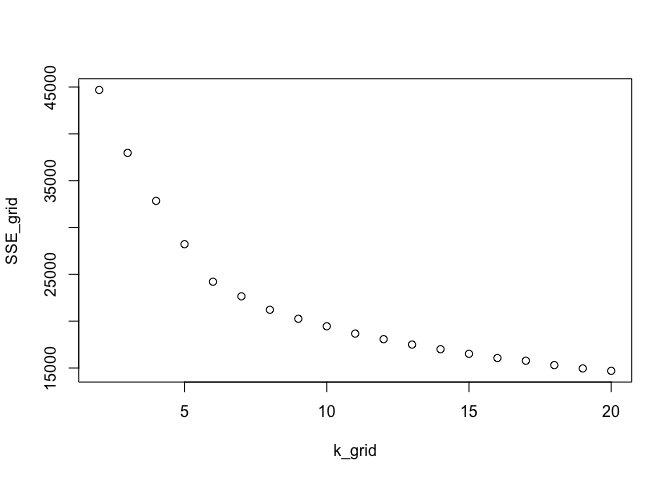

    # CH index
    N = nrow(try1)
    k_grid = seq(2, 20, by=1)
    CH_grid = foreach(k = k_grid, .combine='c') %do% {
      cluster_k = kmeans(cars, k, nstart=50)
      W = cluster_k$tot.withinss
      B = cluster_k$betweenss
      CH = (B/W)*((N-k)/(k-1))
      CH
    }

    plot(k_grid, CH_grid)

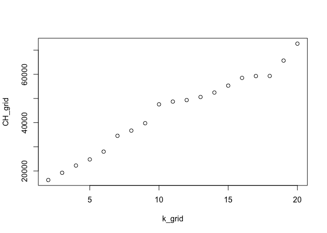

    # From above two plots, k = 10 prob a good estimate 

    # Center and scale the data
    try1 = social_marketing[girl_col]
    try1 = scale(try1, center=TRUE, scale=TRUE)

    # Extract the centers and scales from the rescaled data (which are named attributes)
    mu = attr(try1,"scaled:center")
    sigma = attr(try1,"scaled:scale")

    # Run k-means with 10 clusters and 25 starts
    clust1 = kmeans(try1, 10, nstart=25)

    # What are the clusters?
    clust1$center  # not super helpful

    ##        chatter photo_sharing     tv_film      beauty      dating
    ## 1   0.07232720    1.79475040 -0.04237246  3.67280461 -0.04846846
    ## 2  -0.46949557   -0.44957824 -0.23895447 -0.29057661 -0.09619789
    ## 3   2.17912768    2.16768635 -0.07693083 -0.05456317 -0.11056196
    ## 4   0.81476970    0.46065629 -0.27745240 -0.30848983 -0.18688804
    ## 5   0.91378430   -0.02678417 -0.09131243  0.26650265  4.35463173
    ## 6   0.03994713    0.07585403  3.62663760  0.01008513 -0.10901575
    ## 7  -0.55047211   -0.56522595 -0.42195359 -0.29730628 -0.20566954
    ## 8   0.07456081    0.07953939 -0.09764824 -0.14262464  0.15900897
    ## 9  -0.43854853   -0.49828852  1.01297394 -0.25685975 -0.19589792
    ## 10 -0.25339657    0.43175556 -0.22528431  1.43343822 -0.14600514
    ##    personal_fitness     fashion
    ## 1        0.13593799  3.62725471
    ## 2        1.27886310 -0.28867911
    ## 3        0.04004622 -0.07012056
    ## 4       -0.32446618 -0.27721113
    ## 5       -0.06784030  0.77281231
    ## 6       -0.04893250 -0.01985852
    ## 7       -0.43309878 -0.35636078
    ## 8        3.24474756 -0.09215330
    ## 9       -0.42652437 -0.28710332
    ## 10      -0.16523624  1.47080735

    clust1$center[1,]*sigma + mu

    ##          chatter    photo_sharing          tv_film           beauty 
    ##        4.6540084        7.5991561        1.0000000        5.5822785 
    ##           dating personal_fitness          fashion 
    ##        0.6244726        1.7890295        7.6286920

    clust1$center[2,]*sigma + mu

    ##          chatter    photo_sharing          tv_film           beauty 
    ##        2.7418478        1.4687500        0.6739130        0.3192935 
    ##           dating personal_fitness          fashion 
    ##        0.5394022        4.5380435        0.4687500

    clust1$center[4,]*sigma + mu

    ##          chatter    photo_sharing          tv_film           beauty 
    ##        7.2741813        3.9550647        0.6100533        0.2955065 
    ##           dating personal_fitness          fashion 
    ##        0.3777609        0.6816451        0.4897182

    # Which cars are in which clusters?
    summary(clust1)

    ##              Length Class  Mode   
    ## cluster      7882   -none- numeric
    ## centers        70   -none- numeric
    ## totss           1   -none- numeric
    ## withinss       10   -none- numeric
    ## tot.withinss    1   -none- numeric
    ## betweenss       1   -none- numeric
    ## size           10   -none- numeric
    ## iter            1   -none- numeric
    ## ifault          1   -none- numeric

    # which(clust1$cluster == 1)
    # which(clust1$cluster == 2)
    # which(clust1$cluster == 3)
    # which(clust1$cluster == 4)
    # which(clust1$cluster == 5)

    # A few plots with cluster membership shown
    # qplot is in the ggplot2 library

    # Attributes:"chatter","photo_sharing","tv_film","beauty","dating","personal_fitness","fashion"

    # Audience who love to chat and share photos
    qplot(chatter, photo_sharing, data=social_marketing, color=factor(clust1$cluster)) +
      labs(title = "Audience love chatter and photo_sharing")

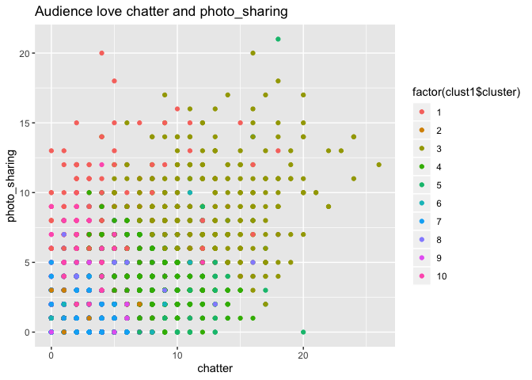

    # Audience who are like to focus on beauty and fashion - beauty type 1
    qplot(beauty, fashion, data=social_marketing, color=factor(clust1$cluster)) +
      labs(title = "Audience love beauty and fashion")

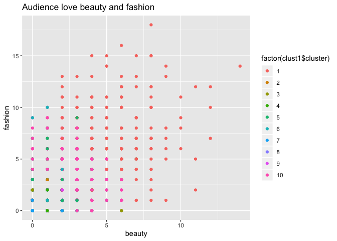

    # Audience who like to focus on beauty also on fitness - beauty type 2
    qplot(photo_sharing, tv_film, data=social_marketing, color=factor(clust1$cluster))+
      labs(title = "Audience love photo_sharing and tv_film")

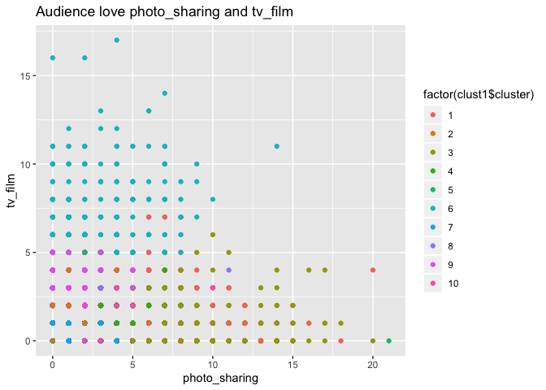

In part(b), what we did is we first targeted all the potential ‘girls’
with the
attributes:“chatter”,“photo\_sharing”,“tv\_film”,“beauty”,“dating”,“personal\_fitness”,“fashion”.
After we segment these attributes user from the original dataset, we
used the k-elbow and the CH-index to determine what is the best
k(clusters) to use for later clustering. However, the k-elbow and
ch-index is not in harmony, we have to estimate our by our best
approximate equal to 10.

Then after we scaled our new girl dateset and clustered it by group
their correlated interests, below are the interesting market segments
that appear to stand out:

By speicifc the attributes to three combinations:

1.  (chatter, photo\_sharing), we can find all the user who addicted to
    chat via internet. By observing the plot “Audience love chatter and
    photo\_sharing”, the X-AXIS represents the degree of chatter, the
    Y-AXIS represents the degree of photo\_sharing. Therefore, the high
    value brown dots(factor2) represent the stand-out audience that fits
    into our combination 1. They are the most active users in
    NutrientH20 follower list. For the future, if NutrientH20 has some
    events or party, they will be very likely to participate in.

2.  (beauty, fashion), we can find all users who are potentially willing
    to spend more on cosmetic. By observing the plot “Audience love
    beauty and fashion”, the X-AXIS represents the degree of beauty, the
    Y-AXIS represents the degree of fashion. Therefore, the high value
    deep green dots(factor3) represent the stand-out audience that fits
    into our combination 2. They are the potential users that willing to
    pay most for beauty and fashion items in NutrientH20 follower list.
    For the future, if NutrientH20 have new beauty and fashion items
    that want to sell, it would be high-rewarded if the company send
    these users about the new product message in the first place.

3.  (photo\_sharing, tv\_film), we can find all users who are Movie
    enthusiast. By observing the plot “Audience love photo\_sharing and
    tv\_film”, the X-AXIS represents the degree of photo\_sharing, the
    Y-AXIS represents the degree of tv\_film. Therefore, the high value
    light blue dots(factor7) represent the stand-out audience that fits
    into our combination 3. They are the potential users that willing to
    pay most for new tv/movies and related movie items in NutrientH20
    follower list. For the future, if NutrientH20 have new tv/movies
    related items that want to sell, it would be best if the company
    send these users about the new product message in the first place.

try2 = student athelete

“sports\_fandom”,“food”,“health\_nutrition”,“sports\_playing”,“outdoors”,“personal\_fitness”

    athelete_col =  c("sports_fandom","food","health_nutrition","sports_playing","outdoors","personal_fitness")
    try2 = social_marketing[athelete_col]

    try2 = scale(try2)

    #k elbow
    library(foreach)
    k_grid = seq(2, 20, by=1)
    SSE_grid = foreach(k = k_grid, .combine='c') %do% {
      cluster_k = kmeans(try2, k, nstart=50)
      cluster_k$tot.withinss
    }

    ## Warning: did not converge in 10 iterations

    ## Warning: did not converge in 10 iterations

    ## Warning: did not converge in 10 iterations

    ## Warning: did not converge in 10 iterations

    ## Warning: did not converge in 10 iterations

    ## Warning: did not converge in 10 iterations

    ## Warning: did not converge in 10 iterations

    ## Warning: did not converge in 10 iterations

    ## Warning: did not converge in 10 iterations

    ## Warning: did not converge in 10 iterations

    ## Warning: did not converge in 10 iterations

    plot(k_grid, SSE_grid)

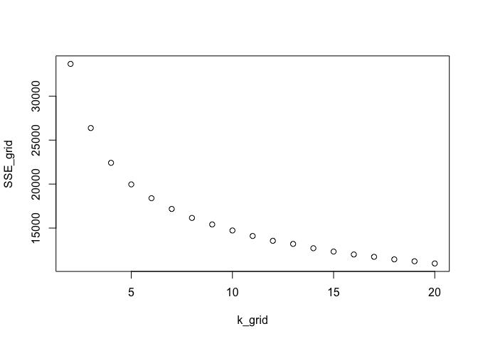

    # CH index
    N = nrow(try2)
    k_grid = seq(2, 20, by=1)
    CH_grid = foreach(k = k_grid, .combine='c') %do% {
      cluster_k = kmeans(cars, k, nstart=50)
      W = cluster_k$tot.withinss
      B = cluster_k$betweenss
      CH = (B/W)*((N-k)/(k-1))
      CH
    }

    plot(k_grid, CH_grid)

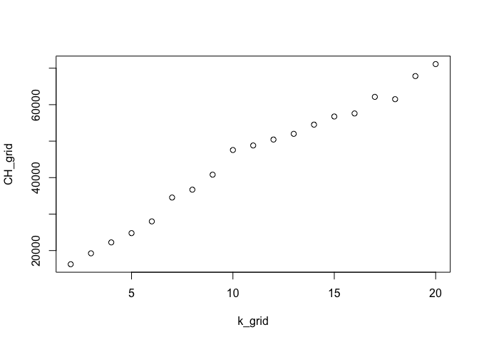

    # From above two plots, k = 10 prob a good estimate 

    # Center and scale the data
    try2 = social_marketing[athelete_col]
    try2 = scale(try2, center=TRUE, scale=TRUE)

    # Extract the centers and scales from the rescaled data (which are named attributes)
    mu = attr(try2,"scaled:center")
    sigma = attr(try2,"scaled:scale")

    # Run k-means with 10 clusters and 25 starts
    clust1 = kmeans(try2, 10, nstart=25)

    # What are the clusters?
    clust1$center  # not super helpful

    ##    sports_fandom        food health_nutrition sports_playing     outdoors
    ## 1   -0.105746097  0.03980978       0.52965908    -0.05321166  1.795937781
    ## 2    1.374685350  0.02225422      -0.40816851    -0.28572677 -0.157887994
    ## 3    3.368751596  2.77848935      -0.04017325     0.28604090 -0.001653788
    ## 4   -0.362137206 -0.05991746       1.09962458    -0.26868213  0.082418334
    ## 5    0.088295113  1.03086515       3.41555096     0.25309461  3.837492159
    ## 6   -0.100120480  0.53555934       2.43572610     0.15722466  1.246172399
    ## 7   -0.361101129 -0.40968310      -0.41433613     0.64093732 -0.364388986
    ## 8    0.002190926 -0.03672061      -0.23004745     3.22344092 -0.118373676
    ## 9   -0.424397783 -0.46829083      -0.44358749    -0.65521966 -0.413713627
    ## 10   0.636513878  1.71187657      -0.33032322    -0.10745762 -0.198997964
    ##    personal_fitness
    ## 1        0.38073388
    ## 2       -0.38970870
    ## 3        0.03972792
    ## 4        1.09843606
    ## 5        3.06554222
    ## 6        2.61204889
    ## 7       -0.41222949
    ## 8       -0.20253405
    ## 9       -0.44215743
    ## 10      -0.30556824

    clust1$center[1,]*sigma + mu

    ##    sports_fandom             food health_nutrition   sports_playing 
    ##         1.365503         1.468172         4.948665         0.587269 
    ##         outdoors personal_fitness 
    ##         2.954825         2.377823

    clust1$center[2,]*sigma + mu

    ##    sports_fandom             food health_nutrition   sports_playing 
    ##        4.5645933        1.4370016        0.7320574        0.3604466 
    ##         outdoors personal_fitness 
    ##        0.5917065        0.5247209

    clust1$center[4,]*sigma + mu

    ##    sports_fandom             food health_nutrition   sports_playing 
    ##        0.8114630        1.2911011        7.5113122        0.3770739 
    ##         outdoors personal_fitness 
    ##        0.8823529        4.1040724

    # Which cars are in which clusters?
    summary(clust1)

    ##              Length Class  Mode   
    ## cluster      7882   -none- numeric
    ## centers        60   -none- numeric
    ## totss           1   -none- numeric
    ## withinss       10   -none- numeric
    ## tot.withinss    1   -none- numeric
    ## betweenss       1   -none- numeric
    ## size           10   -none- numeric
    ## iter            1   -none- numeric
    ## ifault          1   -none- numeric

    # which(clust1$cluster == 1)
    # which(clust1$cluster == 2)
    # which(clust1$cluster == 3)
    # which(clust1$cluster == 4)
    # which(clust1$cluster == 5)

    # A few plots with cluster membership shown
    # qplot is in the ggplot2 library

    # attributes: "sports_fandom","food","health_nutrition","sports_playing","outdoors","personal_fitness"
    qplot(food, health_nutrition, data=social_marketing, color=factor(clust1$cluster))+
      labs(title = "Audience love food and health_nutrition")

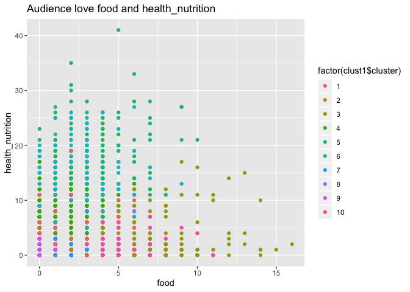

    qplot(outdoors, personal_fitness, data=social_marketing, color=factor(clust1$cluster))+
      labs(title = "Audience love outdoors and personal_fitness")

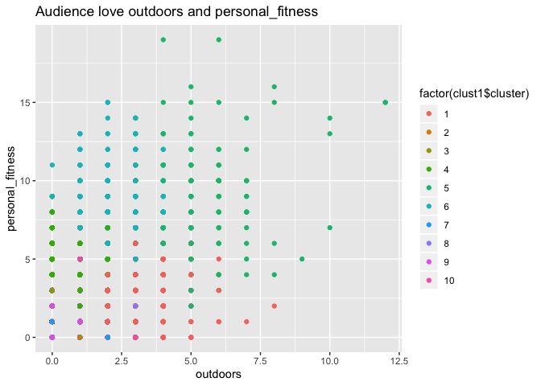

Here is the second group or related interets we have explored:

4.(food, health\_nutrition), we can find all users who are love food and
health\_nutrition items. By observing the plot “Audience love food and
health\_nutrition”, the X-AXIS represents the degree of food, the Y-AXIS
represents the degree of health\_nutrition. Therefore, the high value
light blue dots(factor6) represent the stand-out audience that fits into
our combination 4. They are the potential users that willing to pay most
for all kinds of food and health\_nutritionss in NutrientH20 follower
list. For the future, if NutrientH20 have all kinds of food and
health\_nutritionss related items that want to sell, it would be best if
the company send these users about the related product message in
certain frequency.

5.(outdoors, personal\_fitness), we can find all users who are love food
and health\_nutrition items. By observing the plot “Audience love
outdoors and personal\_fitness”, the X-AXIS represents the degree of
outdoors, the Y-AXIS represents the degree of personal\_fitness.
Therefore, the high value light blue dots(factor6) represent the
stand-out audience that fits into our combination 5. They are the
potential users that willing to pay for outdoors and personal\_fitness
related items. For the future, if NutrientH20 have fitness related
products, it would be nice to send uers the message of them.

################### 

Question 5 \#\#\#\#\#\#\#\#\#\#\#\#\#\#\#\#\#\#\# Your task is to build
the best model you can, using any combination of tools you see fit, for
predicting the author of an article on the basis of that article’s
textual content. Describe clearly what models you are using, how you
constructed features, and so forth.

In the C50train directory, you have ~50 articles from each of 50
different authors (one author per directory). Use this training data
(and this data alone) to build the model. Then apply your model to
predict the authorship of the articles in the C50test directory, which
is about the same size as the training set. Describe your data
pre-processing and analysis pipeline in detail.

    rm(list=ls())
    library(tm)

    ## Loading required package: NLP

    ## 
    ## Attaching package: 'NLP'

    ## The following object is masked from 'package:ggplot2':
    ## 
    ##     annotate

    ## 
    ## Attaching package: 'tm'

    ## The following object is masked from 'package:mosaic':
    ## 
    ##     inspect

    library(proxy)

    ## 
    ## Attaching package: 'proxy'

    ## The following object is masked from 'package:Matrix':
    ## 
    ##     as.matrix

    ## The following objects are masked from 'package:stats':
    ## 
    ##     as.dist, dist

    ## The following object is masked from 'package:base':
    ## 
    ##     as.matrix

    library(randomForest)

    ## randomForest 4.6-14

    ## Type rfNews() to see new features/changes/bug fixes.

    ## 
    ## Attaching package: 'randomForest'

    ## The following object is masked from 'package:ggplot2':
    ## 
    ##     margin

    ## The following object is masked from 'package:dplyr':
    ## 
    ##     combine

    library(dplyr)
    library(caret)

    ## 
    ## Attaching package: 'caret'

    ## The following object is masked from 'package:purrr':
    ## 
    ##     lift

    ## The following object is masked from 'package:mosaic':
    ## 
    ##     dotPlot

    library(e1071)
    set.seed(1)

In Question Q5, we have three sections for our contents. 1. Data
pre-processing 2. Model1: RandomForest 3. Model2: Naive Bayer 4. Model3:
Knn

1.  Data pre-processing

Step1: Function Def and Array Def

    ###############################################################################################################
    # define the function that will read in the files
    readerPlain = function(fname){
      readPlain(elem = list(content = readLines(fname)), 
                id = fname, language = 'en') }

    # Define all the array that we will use for later
    file_path_train = character(0)
    folder_name_train = character(0)

    file_path_test = character(0)
    folder_name_test = character(0)

    text_train = character(0)
    text_test = character(0)

Step2: Read Data

    ################################################################################################################
    # read folders for train
    author_folder_train = dir("../Data/ReutersC50/C50train/")

    # read folders for test
    author_folder_test = dir("../Data/ReutersC50/C50test/")

    # Read every single txt files
    for (file_txt in author_folder_train){
      file_path_train = c(file_path_train, Sys.glob(paste('../Data/ReutersC50/C50train/', file_txt,'/*.txt',sep = "")))
      folder_name_train = c(folder_name_train, rep(file_txt, each = length(Sys.glob(paste('../Data/ReutersC50/C50train/', ... =     file_txt,'/*.txt',sep = "")))))
    }

    for (file_txt in author_folder_test){
      file_path_test = c(file_path_test, Sys.glob(paste('../Data/ReutersC50/C50test/', file_txt,'/*.txt',sep = "")))
      folder_name_test = c(folder_name_test, rep(file_txt, each = length(Sys.glob(paste('../Data/ReutersC50/C50test/', file_txt,'/*.txt',sep = "")))))
    }

    # store file as list
    file_list_train = lapply(file_path_train, readerPlain)

    # clean the file name
    file_names_train = file_path_train %>%
      { strsplit(., '/', fixed=TRUE) } %>%
      { lapply(., tail, n=2) } %>%
      { lapply(., paste0, collapse = '') } %>%
      unlist

    # store file as list
    file_list_test = lapply(file_path_test, readerPlain)

    # clean the file name
    file_names_test = file_path_test %>%
      strsplit("/") %>%
      lapply(tail,n = 2) %>%
      lapply(paste0, collapse = "") %>%
      unlist

    # create a dataframe with doc_id as author-article and text as the text in that article
    for(index_id in 1:length(file_names_train)){
      text_train = c(text_train, paste(content(file_list_train[[index_id]]), collapse = "\t",sep = ""))
    }

    for(index_id in 1:length(file_names_test)){
      text_test = c(text_test, paste(content(file_list_test[[index_id]]), collapse = "\t",sep = ""))
    }

    # dataframe with text and document_id
    text_df_train = data.frame(doc_id = file_names_train,
                                text = text_train)
    # convert the dataframe to a Corpus
    train_corpus_raw = Corpus(DataframeSource(text_df_train))

    # dataframe with text and document_id
    text_df_test = data.frame(doc_id = file_names_test,
                               text = text_test)
    # convert the dataframe to a Corpus
    test_corpus_raw = Corpus(DataframeSource(text_df_test))

Step 3 Some pre-processing/tokenization steps. tm\_map just maps some
function to every document in the corpus

    #########################################################################################################

    # Clean test
    my_documents_train = train_corpus_raw
    my_documents_train = tm_map(my_documents_train, content_transformer(tolower)) # make everything lowercase
    my_documents_train = tm_map(my_documents_train, content_transformer(removeNumbers)) # remove numbers
    my_documents_train = tm_map(my_documents_train, content_transformer(removePunctuation)) # remove punctuation
    my_documents_train = tm_map(my_documents_train, content_transformer(stripWhitespace)) ## remove excess white-space
    my_documents_train = tm_map(my_documents_train, content_transformer(removeWords), stopwords("en"))# remove stop words
    # Clean Train
    my_documents_test = test_corpus_raw
    my_documents_test = tm_map(my_documents_test, content_transformer(tolower)) # make everything lowercase
    my_documents_test = tm_map(my_documents_test, content_transformer(removeNumbers)) # remove numbers
    my_documents_test = tm_map(my_documents_test, content_transformer(removePunctuation)) # remove punctuation
    my_documents_test = tm_map(my_documents_test, content_transformer(stripWhitespace)) ## remove excess white-space
    my_documents_test = tm_map(my_documents_test, content_transformer(removeWords), stopwords("en")) # remove stop words

Step 4: drop unnecessary stuff.

    ####################################################################################################################
    ## create a doc-term-matrix
    DTM_documents_train = DocumentTermMatrix(my_documents_train)
    DTM_documents_test = DocumentTermMatrix(my_documents_test)

    # removes those terms that have count 0 in >98% of docs
    DTM_documents_train = removeSparseTerms(DTM_documents_train, 0.98)
    DTM_documents_test = removeSparseTerms(DTM_documents_test, 0.98)

    # calculate the TF-IDF 
    tfidf_documents_train = weightTfIdf(DTM_documents_train)
    tfidf_documents_test = weightTfIdf(DTM_documents_test)
    X_train = as.data.frame(as.matrix(tfidf_documents_train))
    X_test = as.data.frame(as.matrix(tfidf_documents_test))

Step 5: Get the common items from both train and test dataset

    ####################################################################################################################
    common_terms=intersect(names(X_train),names(X_test))
    X_train=X_train[,common_terms]
    X_test=X_test[,common_terms]

    #rename column to prevent error
    colnames(X_train)[colnames(X_train)=="next"] <- "next_c"
    colnames(X_train)[colnames(X_train)=="break"] <- "break_c"
    colnames(X_test)[colnames(X_test)=="next"] <- "next_c"
    colnames(X_test)[colnames(X_test)=="break"] <- "break_c"
    colnames(X_train)[colnames(X_train)=="else"] <- "else_c"
    colnames(X_test)[colnames(X_test)=="else"] <- "else_c"
    colnames(X_train)[colnames(X_train)=="function"] <- "f_c"
    colnames(X_test)[colnames(X_test)=="function"] <- "f_c"

    # Cbind folder_name into the train and test dataset
    X_train = cbind(X_train, folder_name_train)
    X_test = cbind(X_test, folder_name_test)

2.  Model1: RandomForest

<!-- -->

    # Run the RF model in train dataset
    for(i in c(50,100,200)){
      rf_model = randomForest(folder_name_train~.,data = X_train,ntree =i)
    # Predict with test dataset and put into a table with our original folder_name_test
    table = as.data.frame(table(predict(rf_model, X_test, type = "response"),folder_name_test))

    # Create a new "correct" col contains 1 if the name matches else contains 0
    table$correct = ifelse(table$Var1==table$folder_name_test, 1, 0)

    # Filter all the correct = 1 rows and create a new col called "correct_num" contains the number of correctness
    correctness_table = table %>% 
      filter(correct == 1) 
    table$correct_num = table$Freq * table$correct

    # Calculate accuracy by sum the total number of correctness by the total number of counts
    total_num_correct = sum(table$correct_num)
    total = sum(table$Freq)
    accuracy = total_num_correct/total * 100 

    # print it out
    cat("Accuracy is", accuracy,"%", " when ntree = ", i)
    }

    ## Accuracy is 57.96 %  when ntree =  50Accuracy is 61.76 %  when ntree =  100Accuracy is 62.52 %  when ntree =  200

We have used the Randomforest tree to test our accuracy. With the loop
we used above, we used ntree = 50, 100, and 200 to improve the accuracy.
The corresponding accuracy is: 
Accuracy is 57.96 %  when ntree =  50
Accuracy is 61.76 %  when ntree =  100
Accuracy is 62.52 %  when ntree =  200

3.  Model2: Naive Bayer

<!-- -->

    NBclassfier=naiveBayes(folder_name_train~., data=X_train)
    #print(NBclassfier)

    NB_fit = predict(NBclassfier, X_test, type = "class")

    # Predict with test dataset and put into a table with our original folder_name_test
    table = as.data.frame(table(NB_fit,folder_name_test))

    # Create a new "correct" col contains 1 if the name matches else contains 0
    table$correct = ifelse(table$NB_fit==table$folder_name_test, 1, 0)

    # Filter all the correct = 1 rows and create a new col called "correct_num" contains the number of correctness
    correctness_table = table %>% 
      filter(correct == 1) 
    table$correct_num = table$Freq * table$correct

    # Calculate accuracy by sum the total number of correctness by the total number of counts
    total_num_correct = sum(table$correct_num)
    total = sum(table$Freq)
    accuracy = total_num_correct/total * 100 

    # print it out
    cat("Accuracy is", accuracy,"%")

    ## Accuracy is 44.56 %

We have used the Naive Bayer to test our accuracy as well. The final
accuracy we get is 44.56 %

4.Model3: Knn

    library(class)
    X_train_no_ans = subset(X_train, select = -c(folder_name_train) )
    X_test_no_ans = subset(X_test, select = -c(folder_name_test) )

    for(i in c(5,10,15)){
    knn_model <- knn(train = X_train_no_ans, test = X_test_no_ans,cl = X_train$folder_name_train, k=i)

    table = as.data.frame(table(knn_model,folder_name_test))
    # Create a new "correct" col contains 1 if the name matches else contains 0
    table$correct = ifelse(table$knn_model==table$folder_name_test, 1, 0)

    # Filter all the correct = 1 rows and create a new col called "correct_num" contains the number of correctness
    correctness_table = table %>% 
      filter(correct == 1) 
    table$correct_num = table$Freq * table$correct

    # Calculate accuracy by sum the total number of correctness by the total number of counts
    total_num_correct = sum(table$correct_num)
    total = sum(table$Freq)
    accuracy = total_num_correct/total * 100 

    # print it out
    cat("Accuracy is", accuracy,"%", " when k is = ",i)
    }

    ## Accuracy is 44.36 %  when k is =  5Accuracy is 44.16 %  when k is =  10Accuracy is 42.56 %  when k is =  15

And for Knn, With the loop we used above, we used k = 5, 10, and 15 to
improve the accuracy. The corresponding accuracy is: 
Accuracy is 44.36 %  when k is =  5
Accuracy is 44.16 %  when k is =  10
Accuracy is 42.56 %  when k is =  15

Therefore, our RandomForest model &gt; Knn &gt; Naive Bayers. For future
improvement, there are several good ways to improve accuracy. First of
all, if we increase the number in
“removeSparseTerms(DTM\_documents\_train, 0.98)”, we can utalize more
information to predict, and thus improve the accuracy. Second, by
increase the number of tree that we used in Randomforest, might also be
helpful but also sort of limited since the number of tree doesn’t have
linear relationship with the accuracy we will get. Last but not least,
if we can have more files to train out model, the model’s accuracy might
improve as well.

################### 

Question 6 \#\#\#\#\#\#\#\#\#\#\#\#\#\#\#\#\#\#\#

    rm(list=ls())
    library(arules)

    ## 
    ## Attaching package: 'arules'

    ## The following object is masked from 'package:tm':
    ## 
    ##     inspect

    ## The following objects are masked from 'package:mosaic':
    ## 
    ##     inspect, lhs, rhs

    ## The following object is masked from 'package:dplyr':
    ## 
    ##     recode

    ## The following objects are masked from 'package:base':
    ## 
    ##     abbreviate, write

    library(arulesViz)

    ## Loading required package: grid

    ## Registered S3 methods overwritten by 'registry':
    ##   method               from 
    ##   print.registry_field proxy
    ##   print.registry_entry proxy

    ## Registered S3 method overwritten by 'seriation':
    ##   method         from 
    ##   reorder.hclust gclus

    #read in groceries.txt as transaction 
    groceries_tran <- read.transactions("../Data/groceries.txt", sep = ",")

    #summary of our transaction
    summary(groceries_tran)

    ## transactions as itemMatrix in sparse format with
    ##  9835 rows (elements/itemsets/transactions) and
    ##  169 columns (items) and a density of 0.02609146 
    ## 
    ## most frequent items:
    ##       whole milk other vegetables       rolls/buns             soda 
    ##             2513             1903             1809             1715 
    ##           yogurt          (Other) 
    ##             1372            34055 
    ## 
    ## element (itemset/transaction) length distribution:
    ## sizes
    ##    1    2    3    4    5    6    7    8    9   10   11   12   13   14   15 
    ## 2159 1643 1299 1005  855  645  545  438  350  246  182  117   78   77   55 
    ##   16   17   18   19   20   21   22   23   24   26   27   28   29   32 
    ##   46   29   14   14    9   11    4    6    1    1    1    1    3    1 
    ## 
    ##    Min. 1st Qu.  Median    Mean 3rd Qu.    Max. 
    ##   1.000   2.000   3.000   4.409   6.000  32.000 
    ## 
    ## includes extended item information - examples:
    ##             labels
    ## 1 abrasive cleaner
    ## 2 artif. sweetener
    ## 3   baby cosmetics

    #plot a top 10 groceries item across from all transactions
    itemFrequencyPlot(groceries_tran,topN=10)

    #generate rules with condience 0.1, and support 0.005
    groceries_rule = apriori(groceries_tran, 
        parameter=list(support=.005, confidence=.15, maxlen=5))

    ## Apriori
    ## 
    ## Parameter specification:
    ##  confidence minval smax arem  aval originalSupport maxtime support minlen
    ##        0.15    0.1    1 none FALSE            TRUE       5   0.005      1
    ##  maxlen target   ext
    ##       5  rules FALSE
    ## 
    ## Algorithmic control:
    ##  filter tree heap memopt load sort verbose
    ##     0.1 TRUE TRUE  FALSE TRUE    2    TRUE
    ## 
    ## Absolute minimum support count: 49 
    ## 
    ## set item appearances ...[0 item(s)] done [0.00s].
    ## set transactions ...[169 item(s), 9835 transaction(s)] done [0.00s].
    ## sorting and recoding items ... [120 item(s)] done [0.00s].
    ## creating transaction tree ... done [0.00s].
    ## checking subsets of size 1 2 3 4 done [0.00s].
    ## writing ... [1162 rule(s)] done [0.00s].
    ## creating S4 object  ... done [0.00s].

    #Support:Fractionoftransactionsthatcontain both X and Y
    #confidence: Measureshowoftenitemsin Y appear in transactions that contain X

    #inspect 10 rules generated by the apriori algorithm
    inspect(groceries_rule[1:10,])

    ##      lhs              rhs                support     confidence lift    
    ## [1]  {}            => {soda}             0.174377224 0.1743772  1.000000
    ## [2]  {}            => {rolls/buns}       0.183934926 0.1839349  1.000000
    ## [3]  {}            => {other vegetables} 0.193492628 0.1934926  1.000000
    ## [4]  {}            => {whole milk}       0.255516014 0.2555160  1.000000
    ## [5]  {cake bar}    => {whole milk}       0.005592272 0.4230769  1.655775
    ## [6]  {dishes}      => {other vegetables} 0.005998983 0.3410405  1.762550
    ## [7]  {dishes}      => {whole milk}       0.005287239 0.3005780  1.176357
    ## [8]  {mustard}     => {whole milk}       0.005185562 0.4322034  1.691492
    ## [9]  {pot plants}  => {whole milk}       0.006914082 0.4000000  1.565460
    ## [10] {chewing gum} => {soda}             0.005388917 0.2560386  1.468303
    ##      count
    ## [1]  1715 
    ## [2]  1809 
    ## [3]  1903 
    ## [4]  2513 
    ## [5]    55 
    ## [6]    59 
    ## [7]    52 
    ## [8]    51 
    ## [9]    68 
    ## [10]   53

    #LIFT:Measures that take into account statistical dependence: only inpect items with LIFT value >=3, inspect only 50 of them 
    inspect(subset(groceries_rule, subset=lift > 3)[1:50,])

    ##      lhs                     rhs                      support confidence     lift count
    ## [1]  {herbs}              => {root vegetables}    0.007015760  0.4312500 3.956477    69
    ## [2]  {ham}                => {white bread}        0.005083884  0.1953125 4.639851    50
    ## [3]  {sliced cheese}      => {sausage}            0.007015760  0.2863071 3.047435    69
    ## [4]  {berries}            => {whipped/sour cream} 0.009049314  0.2721713 3.796886    89
    ## [5]  {hygiene articles}   => {napkins}            0.006100661  0.1851852 3.536498    60
    ## [6]  {waffles}            => {chocolate}          0.005795628  0.1507937 3.039048    57
    ## [7]  {chicken}            => {frozen vegetables}  0.006710727  0.1563981 3.251956    66
    ## [8]  {beef}               => {root vegetables}    0.017386884  0.3313953 3.040367   171
    ## [9]  {root vegetables}    => {beef}               0.017386884  0.1595149 3.040367   171
    ## [10] {onions,                                                                          
    ##       root vegetables}    => {other vegetables}   0.005693950  0.6021505 3.112008    56
    ## [11] {onions,                                                                          
    ##       other vegetables}   => {root vegetables}    0.005693950  0.4000000 3.669776    56
    ## [12] {chicken,                                                                         
    ##       whole milk}         => {root vegetables}    0.005998983  0.3410405 3.128855    59
    ## [13] {frozen vegetables,                                                               
    ##       other vegetables}   => {root vegetables}    0.006100661  0.3428571 3.145522    60
    ## [14] {beef,                                                                            
    ##       other vegetables}   => {root vegetables}    0.007930859  0.4020619 3.688692    78
    ## [15] {other vegetables,                                                                
    ##       root vegetables}    => {beef}               0.007930859  0.1673820 3.190313    78
    ## [16] {beef,                                                                            
    ##       whole milk}         => {root vegetables}    0.008032537  0.3779904 3.467851    79
    ## [17] {root vegetables,                                                                 
    ##       whole milk}         => {beef}               0.008032537  0.1642412 3.130449    79
    ## [18] {curd,                                                                            
    ##       whole milk}         => {whipped/sour cream} 0.005897306  0.2256809 3.148329    58
    ## [19] {whipped/sour cream,                                                              
    ##       whole milk}         => {curd}               0.005897306  0.1829653 3.434091    58
    ## [20] {curd,                                                                            
    ##       tropical fruit}     => {yogurt}             0.005287239  0.5148515 3.690645    52
    ## [21] {tropical fruit,                                                                  
    ##       yogurt}             => {curd}               0.005287239  0.1805556 3.388862    52
    ## [22] {whole milk,                                                                      
    ##       yogurt}             => {curd}               0.010066090  0.1796733 3.372304    99
    ## [23] {margarine,                                                                       
    ##       whole milk}         => {domestic eggs}      0.005185562  0.2142857 3.377404    51
    ## [24] {butter,                                                                          
    ##       whole milk}         => {domestic eggs}      0.005998983  0.2177122 3.431409    59
    ## [25] {domestic eggs,                                                                   
    ##       whole milk}         => {butter}             0.005998983  0.2000000 3.609174    59
    ## [26] {butter,                                                                          
    ##       other vegetables}   => {whipped/sour cream} 0.005795628  0.2893401 4.036397    57
    ## [27] {other vegetables,                                                                
    ##       whipped/sour cream} => {butter}             0.005795628  0.2007042 3.621883    57
    ## [28] {butter,                                                                          
    ##       whole milk}         => {whipped/sour cream} 0.006710727  0.2435424 3.397503    66
    ## [29] {whipped/sour cream,                                                              
    ##       whole milk}         => {butter}             0.006710727  0.2082019 3.757185    66
    ## [30] {citrus fruit,                                                                    
    ##       whole milk}         => {butter}             0.005083884  0.1666667 3.007645    50
    ## [31] {butter,                                                                          
    ##       other vegetables}   => {root vegetables}    0.006609049  0.3299492 3.027100    65
    ## [32] {root vegetables,                                                                 
    ##       whole milk}         => {butter}             0.008235892  0.1683992 3.038910    81
    ## [33] {whole milk,                                                                      
    ##       yogurt}             => {butter}             0.009354347  0.1669691 3.013104    92
    ## [34] {domestic eggs,                                                                   
    ##       other vegetables}   => {whipped/sour cream} 0.005083884  0.2283105 3.185012    50
    ## [35] {domestic eggs,                                                                   
    ##       other vegetables}   => {root vegetables}    0.007320793  0.3287671 3.016254    72
    ## [36] {pip fruit,                                                                       
    ##       whipped/sour cream} => {other vegetables}   0.005592272  0.6043956 3.123610    55
    ## [37] {tropical fruit,                                                                  
    ##       whipped/sour cream} => {yogurt}             0.006202339  0.4485294 3.215224    61
    ## [38] {other vegetables,                                                                
    ##       tropical fruit}     => {whipped/sour cream} 0.007829181  0.2181303 3.042995    77
    ## [39] {root vegetables,                                                                 
    ##       yogurt}             => {whipped/sour cream} 0.006405694  0.2480315 3.460127    63
    ## [40] {other vegetables,                                                                
    ##       yogurt}             => {whipped/sour cream} 0.010167768  0.2341920 3.267062   100
    ## [41] {citrus fruit,                                                                    
    ##       pip fruit}          => {tropical fruit}     0.005592272  0.4044118 3.854060    55
    ## [42] {pip fruit,                                                                       
    ##       tropical fruit}     => {citrus fruit}       0.005592272  0.2736318 3.306105    55
    ## [43] {citrus fruit,                                                                    
    ##       tropical fruit}     => {pip fruit}          0.005592272  0.2806122 3.709437    55
    ## [44] {pip fruit,                                                                       
    ##       root vegetables}    => {tropical fruit}     0.005287239  0.3398693 3.238967    52
    ## [45] {root vegetables,                                                                 
    ##       tropical fruit}     => {pip fruit}          0.005287239  0.2512077 3.320737    52
    ## [46] {pip fruit,                                                                       
    ##       yogurt}             => {tropical fruit}     0.006405694  0.3559322 3.392048    63
    ## [47] {other vegetables,                                                                
    ##       pip fruit}          => {tropical fruit}     0.009456024  0.3618677 3.448613    93
    ## [48] {other vegetables,                                                                
    ##       tropical fruit}     => {pip fruit}          0.009456024  0.2634561 3.482649    93
    ## [49] {citrus fruit,                                                                    
    ##       root vegetables}    => {tropical fruit}     0.005693950  0.3218391 3.067139    56
    ## [50] {root vegetables,                                                                 
    ##       tropical fruit}     => {citrus fruit}       0.005693950  0.2705314 3.268644    56

    #inspect by LIFT in descending order
    lifts <- sort (groceries_rule, by="lift", decreasing=TRUE)
    inspect((lifts)[1:15,])

    ##      lhs                     rhs                      support confidence     lift count
    ## [1]  {ham}                => {white bread}        0.005083884  0.1953125 4.639851    50
    ## [2]  {citrus fruit,                                                                    
    ##       other vegetables,                                                                
    ##       whole milk}         => {root vegetables}    0.005795628  0.4453125 4.085493    57
    ## [3]  {butter,                                                                          
    ##       other vegetables}   => {whipped/sour cream} 0.005795628  0.2893401 4.036397    57
    ## [4]  {herbs}              => {root vegetables}    0.007015760  0.4312500 3.956477    69
    ## [5]  {citrus fruit,                                                                    
    ##       pip fruit}          => {tropical fruit}     0.005592272  0.4044118 3.854060    55
    ## [6]  {berries}            => {whipped/sour cream} 0.009049314  0.2721713 3.796886    89
    ## [7]  {other vegetables,                                                                
    ##       tropical fruit,                                                                  
    ##       whole milk}         => {root vegetables}    0.007015760  0.4107143 3.768074    69
    ## [8]  {whipped/sour cream,                                                              
    ##       whole milk}         => {butter}             0.006710727  0.2082019 3.757185    66
    ## [9]  {root vegetables,                                                                 
    ##       whole milk,                                                                      
    ##       yogurt}             => {tropical fruit}     0.005693950  0.3916084 3.732043    56
    ## [10] {other vegetables,                                                                
    ##       pip fruit,                                                                       
    ##       whole milk}         => {root vegetables}    0.005490595  0.4060150 3.724961    54
    ## [11] {citrus fruit,                                                                    
    ##       tropical fruit}     => {pip fruit}          0.005592272  0.2806122 3.709437    55
    ## [12] {curd,                                                                            
    ##       tropical fruit}     => {yogurt}             0.005287239  0.5148515 3.690645    52
    ## [13] {beef,                                                                            
    ##       other vegetables}   => {root vegetables}    0.007930859  0.4020619 3.688692    78
    ## [14] {onions,                                                                          
    ##       other vegetables}   => {root vegetables}    0.005693950  0.4000000 3.669776    56
    ## [15] {other vegetables,                                                                
    ##       whipped/sour cream} => {butter}             0.005795628  0.2007042 3.621883    57

    # plot all the rules in (support, confidence) space
    # notice that high lift rules tend to have low support
    plot(groceries_rule)

    ## To reduce overplotting, jitter is added! Use jitter = 0 to prevent jitter.

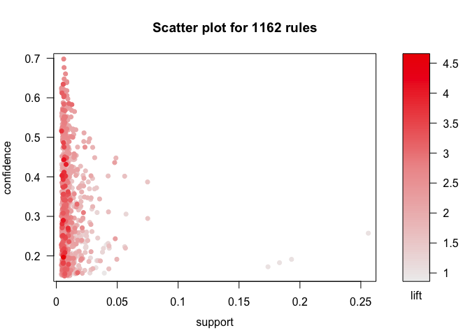

    # can swap the axes and color scales
    plot(groceries_rule, measure = c("support", "lift"), shading = "confidence")

    ## To reduce overplotting, jitter is added! Use jitter = 0 to prevent jitter.

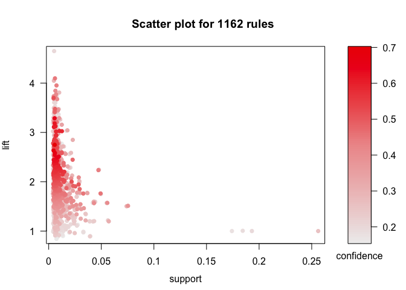

    # "two key" plot: coloring is by size (order) of item set
    plot(groceries_rule, method='two-key plot')

    ## To reduce overplotting, jitter is added! Use jitter = 0 to prevent jitter.

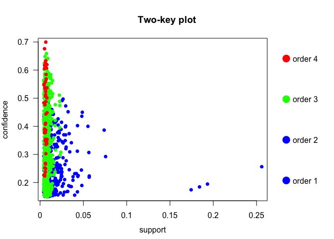

    # graph-based visualization
    sub1 = subset(groceries_rule, subset=confidence > 0.01 & support > 0.005)
    summary(sub1)

    ## set of 1162 rules
    ## 
    ## rule length distribution (lhs + rhs):sizes
    ##   1   2   3   4 
    ##   4 433 677  48 
    ## 
    ##    Min. 1st Qu.  Median    Mean 3rd Qu.    Max. 
    ##   1.000   2.000   3.000   2.662   3.000   4.000 
    ## 
    ## summary of quality measures:
    ##     support           confidence          lift            count       
    ##  Min.   :0.005084   Min.   :0.1506   Min.   :0.8405   Min.   :  50.0  
    ##  1st Qu.:0.005796   1st Qu.:0.2001   1st Qu.:1.5248   1st Qu.:  57.0  
    ##  Median :0.007321   Median :0.2702   Median :1.8738   Median :  72.0  
    ##  Mean   :0.010537   Mean   :0.3035   Mean   :1.9694   Mean   : 103.6  
    ##  3rd Qu.:0.010269   3rd Qu.:0.3852   3rd Qu.:2.3276   3rd Qu.: 101.0  
    ##  Max.   :0.255516   Max.   :0.7000   Max.   :4.6399   Max.   :2513.0  
    ## 
    ## mining info:
    ##            data ntransactions support confidence
    ##  groceries_tran          9835   0.005       0.15

    #graph for rule for confidence > 0.01 and support >0.005
    plot(sub1, method='graph')

    ## Warning: plot: Too many rules supplied. Only plotting the best 100 rules
    ## using 'support' (change control parameter max if needed)

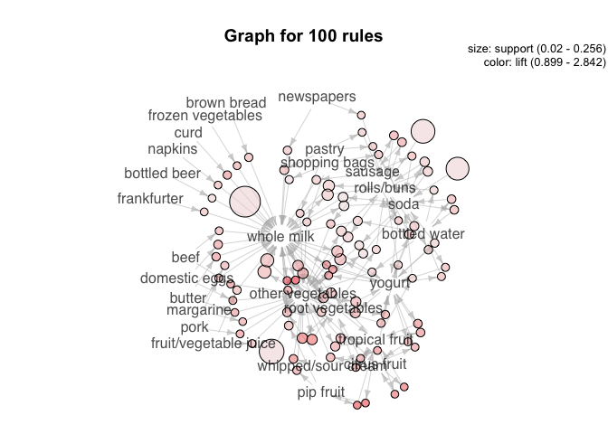

    plot(head(sub1, 30, by='lift'), method='graph')

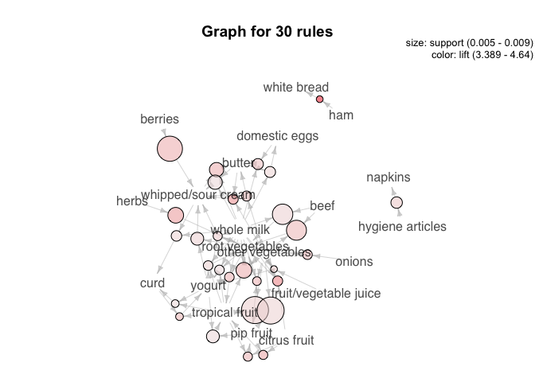 
From the frequency plot, we find that the 10 merchandises that most frequently
show in customers??? baskets are whole milk, other vegetables,
rolls/buns, soda, yogurt, bottled water, root vegetables, tropical
fruit, shopping bags, and sausage. Most of these make sense. It’s
interesting to find that the shopping bag is among these merchandises.
The reason it shows up might be that about 10% of people don’t bring
shopping bags with them when they do groceries shopping. We sort all the
associations rules by lift score in descending order. Among the top 30
association rules that have the highest lift score, we found most of
them make sense. For examples, for the association rule {ham} =&gt;
{white bread}, it has a high lift score because when people want to make
ham sandwiches, they need both ham and bread, so they are often in the
same basket. Anothezr example is {beef, other vegetables} =&gt; {root
vegetables}. These are all necessary ingredients if people are preparing
to make beef stew so they are associated together. For the associations
rule {margarine, whole milk} =&gt; {domestic eggs}, when people buy
margarine and whole milk for baking, they must also have eggs. As for
the rule {berries} =&gt; {whipped/sour cream}, simply mixing them is a
great option for people wants dessert, so they are always being
purchased at the same time. For {hygiene articles} =&gt; {napkins}, a
potential reason they are in the same rule might be that these two
merchandises are often in the same aisle. So, when people buy hygiene
articles, they are likely to see napkins, too, and eventually purchase
both of them. We chose thresholds of 0.15 for confidence and 0.005 for
support. We chose these thresholds because gives us an adequate number
of association rules (1162). We believe using these thresholds generates
the associations rules that represent the patterns in the data the most.
We plotted the relationships between confidence/lift and support. Our
finding is that high confidence/lift rules tend to have low support. We
also plotted a graph for the top 30 rules that have the highest lift
score. From the graph, we see a pattern that merchandises in the same
category tend to be clustered together. These categories include fruits,
vegetables, dairy products, etc.
